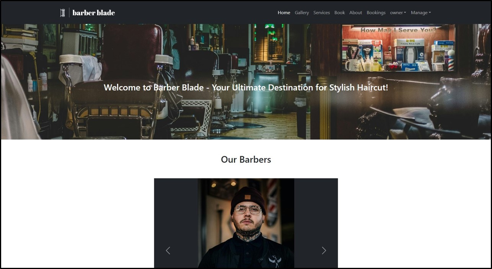
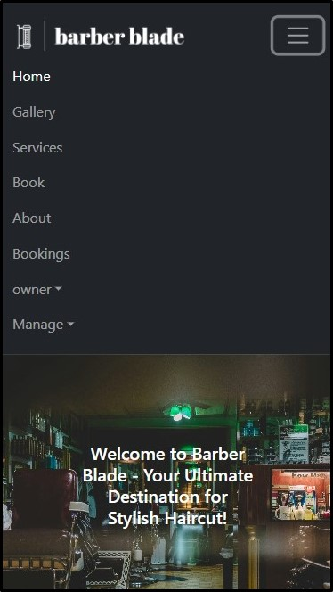

<h1>Barber Blade Application README</h1>
<h2>Overview</h2>
Welcome to Barber Blade, a cutting-edge web application designed to revolutionize the way customers book haircuts. Barber Blade caters to individuals looking to effortlessly reserve timeslots for haircuts without the need for authorization. Additionally, it provides specialized functionalities for two other distinct user groups: barbers and shop owners. Barbers can manage their profiles and bookings, while owners have comprehensive control over bookings, the gallery of haircut images, the services offered, and barber management. Barber Blade is the ultimate solution for streamlining the haircut booking process, offering a seamless, user-friendly experience for customers, barbers, and shop owners alike.
<h2>Responsive Design</h2>
Barber Blade features a responsive design, ensuring a smooth and consistent user experience across various devices. From desktops to smartphones, our application adjusts to fit your screen, providing an intuitive browsing experience whether you're at home or on the go.
<h2>Preview of Hat Heaven</h2>
Here are some previews of Barber Blade across different devices, demonstrating our commitment to a responsive, accessible, and engaging user interface.

<h3>PC View:</h3>

<h3>Mobile View:</h3>

<h2>Key Features</h2>
<h3>User Features:</h3>
<ul>
    <li>Booking System: Effortlessly book timeslots for haircuts by selecting your favorite barber without needing an account</li>
    <li>Services Browsing: Explore the various services offered by the barber shop with ease</li>
    <li>Gallery Browsing: View a wide range of haircut images</li>
</ul>
<h3>Barber Features:</h3>
<ul>
    <li>Account Management: Easy login, logout process and account management.</li>
    <li>Booking Management: Review bookings made by customers.</li>
</ul>
<h3>Owner Features:</h3>
<ul>
    <li>Comprehensive Booking Management: Oversee and manage all barber bookings from a central dashboard.</li>
    <li>Gallery Management: View, add, and delete the gallery of haircut images to showcase the shop's services.</li>
    <li>Service Management: Add, update, or remove the services offered by the barber shop.</li>
    <li>Barber Management: Manage barber profiles, including creating new barbers, with automatic assignment to 'barber' group.</li>
</ul>
<h2>Technology Stack</h2>
<h3>Front-End</h3>
<ul>
    <li>React and Bootstrap: A dynamic interface built with React and Bootstrap for responsive design.</li>
    <li> Redux: For efficient management of global state and API calls.</li>
</ul>

<h3>Back-End</h3>
<ul>
    <li>Python with Django: The back end is powered by Django, a high-level Python web framework that encourages rapid development and clean, pragmatic design.</li>
    <li>MySQL: For database management, providing a reliable and efficient system for storing and querying data.</li>
    <li>Token-Based Authentication: Secure authentication mechanism using tokens to manage user sessions.</li>
    <li>Endpoint Testing with Insomnia: To ensure the reliability and functionality of our API, Insomnia was utilized for comprehensive endpoint testing. This tool allowed us to methodically test and validate all backend communications, ensuring a seamless and bug-free user experience.</li>
</ul>

<h2>Getting Started with Hat Heaven</h2>
<h3>Initial Setup</h3>
<ul>
    <li>Configure the Database: Ensure MySQL is set up and configured to work with Django.</li>
    <li>Create a Superuser: Use Django's command line tool to create a superuser for accessing the Django admin panel.</li>
    <li>Create User Groups: Navigate to the Django administration UI to create two user groups: 'barber' and 'owner'.</li>
    <li>Assign the Owner: Create an owner user and assign it to the 'owner' group through the Django admin panel.</li>
</ul>
<h3>Running Barber Blade</h3>
<ul>
    <li>Launch the servers using 'npm run dev' command</li>
    <li>Create Barbers: Create barbers from the application's UI when logged in with the owner's account. The barbers are assigned to the 'barber' group automatically</li>
</ul>

Barber Blade offers a comprehensive solution for managing haircut bookings, combining ease of use for customers with powerful administrative tools for barbers and shop owners, all within a modern, responsive design framework.
